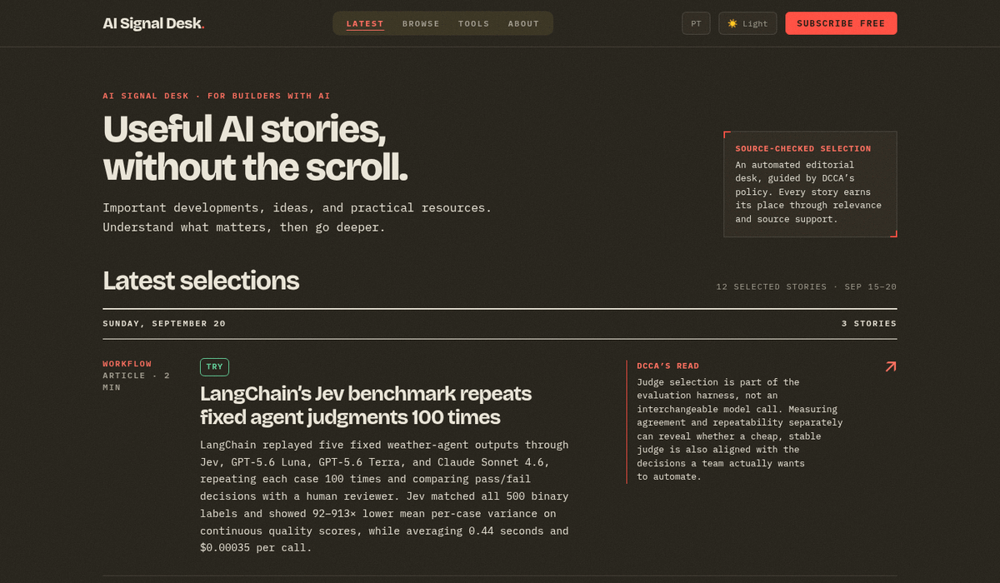

# Daniel Andrade

**I lead fintech product teams at Neon as a Group Product Manager. Separately, I build AI products and tools.**

My bias: getting an AI system to produce something is only part of the job. I care about how it is tested, who reviews it, and what it is allowed to do.

## AI Signal Desk

I built AI Signal Desk and use it regularly to follow AI news, tools, repositories, and concepts. Each selection includes sources, an editorial note, and a recommendation: learn, try, watch, or ignore.

[Visit AI Signal Desk](https://aisignaldesk.ai/?utm_source=github&utm_medium=profile&utm_campaign=readme)

## Selected systems

### [`skval`](https://github.com/DCCA/skval)

A CLI for evaluating Claude Code skills with deterministic checks and LLM-assisted review. Safety gates and scorecards help decide whether to ship, revise, or reject a skill.

### [`vyno`](https://github.com/DCCA/vyno)

A local-first AI digest pipeline with an operator console. It curates and scores sources, delivers digests to Telegram, and archives them in Obsidian.

### [`shotback`](https://github.com/DCCA/shotback)

A Chrome workflow for visual QA: capture screenshots, annotate them, and prepare product feedback for an AI assistant.

### [`loopy`](https://github.com/DCCA/loopy)

Reusable maintenance loops for agents, with deterministic detection, guardrails, and reviewable outputs.

## What I am exploring

- **Evaluation and quality gates:** Making AI-assisted work testable instead of vibe-checked.
- **Human review:** AI drafts, ranks, and proposes; people decide.
- **Local-first automation:** Systems I can inspect and undo, with explicit permissions.
- **Product review artifacts:** Keeping evidence attached to generated claims, alongside screenshots, decisions, and tradeoffs.

I start with the user workflow, not the model. Agents need context, constraints, and review.

## Background

I’m a Group Product Manager / Sr. Manager at Neon in São Paulo, with previous fintech product roles at Mercado Libre, Leve, and PagSeguro PagBank, and earlier PM work at ConectCar and PSafe.

Before product, I spent years in product intelligence and BI. That background is why I insist on evidence and metrics.

Earlier and exploratory systems

- [`firehose`](https://github.com/DCCA/firehose) - an earlier spec-driven workflow method for aligning AI coding agents with product intent.
- [`hermes-product-teams`](https://github.com/DCCA/hermes-product-teams) - a product-memory prototype exploring discovery notes, decision logs, PRD proposals, and weekly product briefs.
- [`sandy`](https://github.com/DCCA/sandy) - a schema-first mobile UI prototyping sandbox for design-system and server-driven UI experiments.

If you’re working on similar problems, I’m happy to compare notes.

[Find me on LinkedIn](https://www.linkedin.com/in/daniel-c-campagnoni-andrade-1004b13b)
